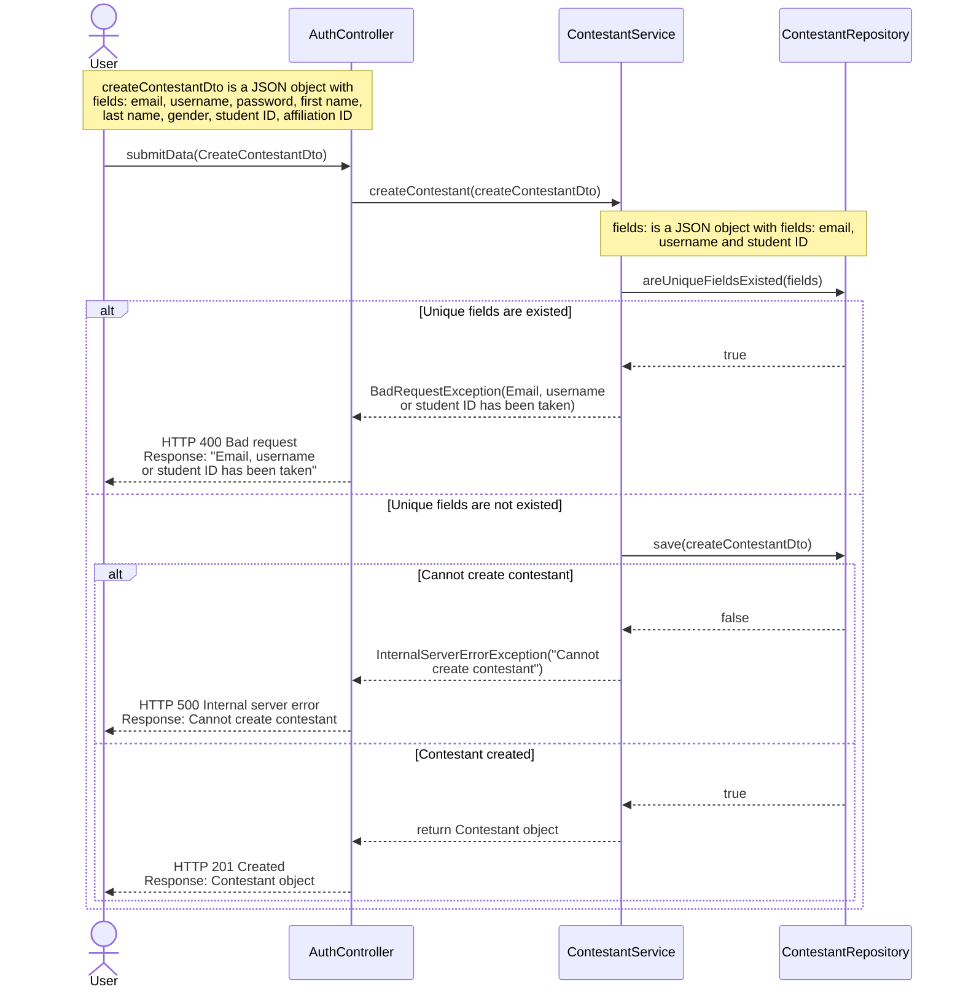
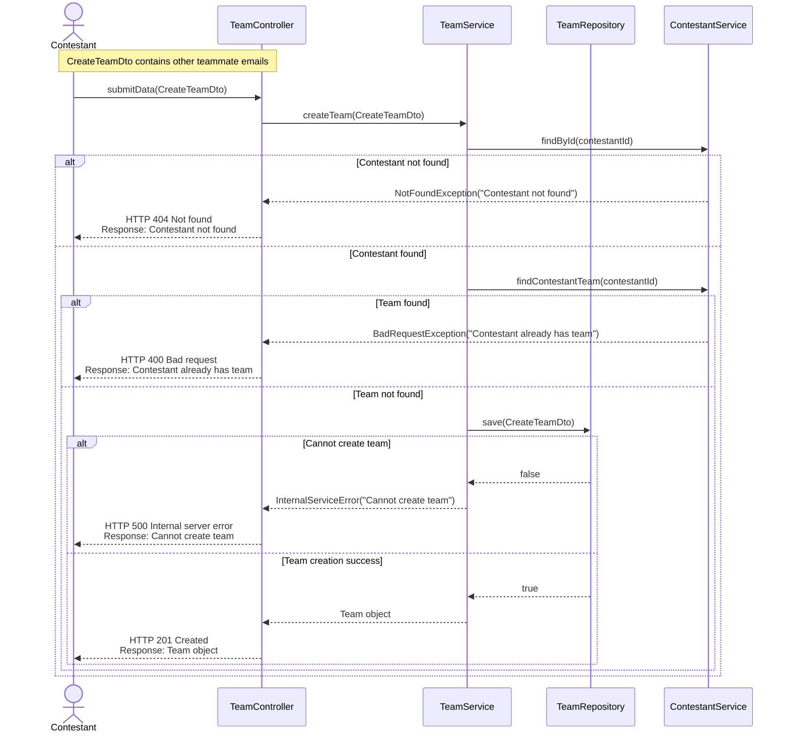
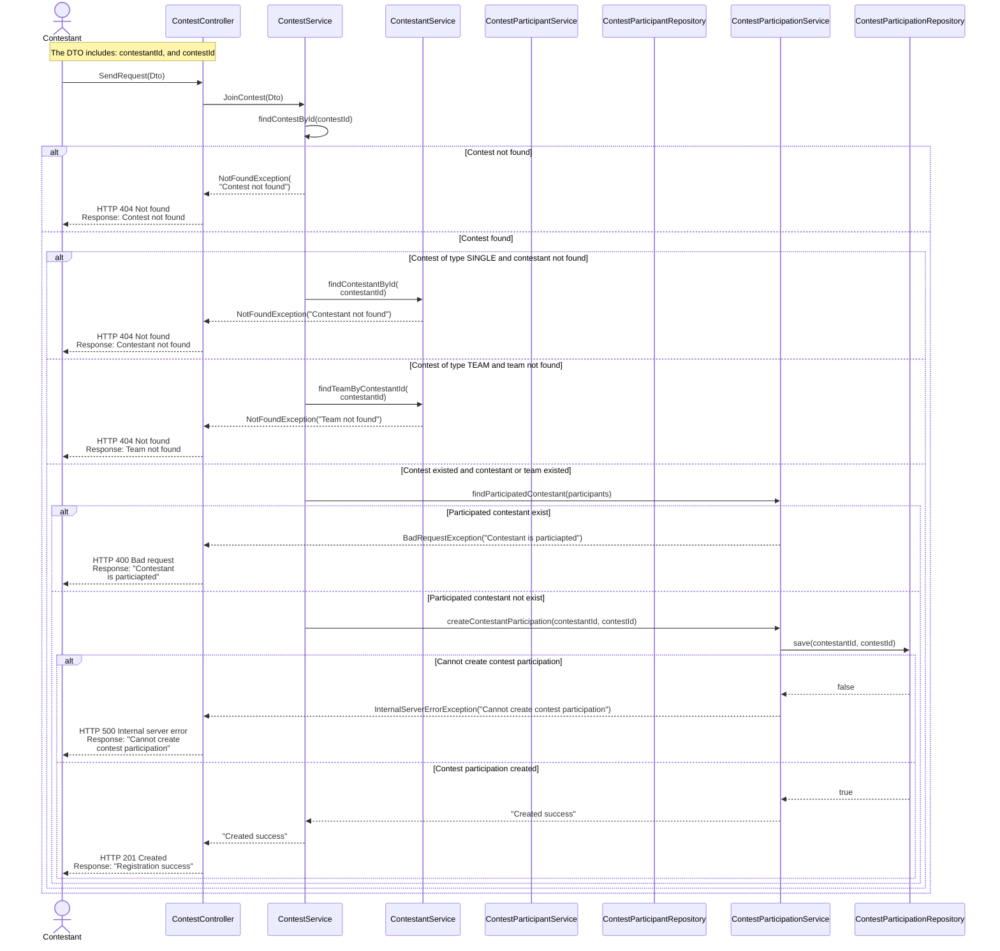

# Component classes sequence diagrams

## Contestant registration sequence diagram

```mermaid
sequenceDiagram
    actor User
    participant AuthController
    participant ContestantService
    participant ContestantRepository

    Note over User,AuthController: createContestantDto is a JSON object with <br/> fields: email, username, password, first name, <br/> last name, gender, student ID, affiliation ID
    User->>AuthController: submitData(CreateContestantDto)
    AuthController->>ContestantService: createContestant(createContestantDto)
    Note over ContestantService,ContestantRepository: fields: is a JSON object with fields: email, <br/>username and student ID
    ContestantService->>ContestantRepository: areUniqueFieldsExisted(fields)
    alt Unique fields are existed
        ContestantRepository-->>ContestantService: true
        ContestantService-->>AuthController: BadRequestException(Email, username <br/> or student ID has been taken)
        AuthController-->>User: HTTP 400 Bad request <br/> Response: "Email, username <br/> or student ID has been taken"
    else Unique fields are not existed
        ContestantService->>ContestantRepository: save(createContestantDto)
        alt Cannot create contestant
            ContestantRepository-->>ContestantService: false
            ContestantService-->>AuthController: InternalServerErrorException("Cannot <br/>create contestant")
            AuthController-->>User: HTTP 500 Internal server error <br/> Response: Cannot create contestant
        else Contestant created
            ContestantRepository-->>ContestantService: true
            ContestantService-->>AuthController: return Contestant object
            AuthController-->>User: HTTP 201 Created <br/> Response: Contestant object
        end
    end
```

## Team registration sequence diagram

```mermaid
sequenceDiagram
    actor Contestant
    participant TeamController
    participant TeamService
    participant TeamRepository
    participant ContestantService

    Note over Contestant,TeamController: CreateTeamDto contains other teammate emails
    Contestant->>TeamController: submitData(CreateTeamDto)
    TeamController->>TeamService: createTeam(CreateTeamDto)
    TeamService->>ContestantService: findById(contestantId)
    alt Contestant not found
        ContestantService-->>TeamController: NotFoundException("Contestant not found")
        TeamController-->>Contestant: HTTP 404 Not found <br/> Response: Contestant not found
    else Contestant found
        TeamService->>ContestantService: findContestantTeam(contestantId)
        alt Team found
            ContestantService-->>TeamController: BadRequestException("Contestant already has team")
            TeamController-->>Contestant: HTTP 400 Bad request <br/> Response: Contestant already has team
        else Team not found
            TeamService->>TeamRepository: save(CreateTeamDto)
            alt Cannot create team
                TeamRepository-->>TeamService: false
                TeamService-->>TeamController: InternalServiceError("Cannot create team")
                TeamController-->>Contestant: HTTP 500 Internal server error <br/> Response: Cannot create team
            else Team creation success
                TeamRepository-->>TeamService: true
                TeamService-->>TeamController: Team object
                TeamController-->>Contestant: HTTP 201 Created <br/> Response: Team object
            end
        end
    end
```

## Contest registration sequence diagram

```mermaid
sequenceDiagram
    actor Contestant
    participant ContestController
    participant ContestService
    participant ContestantService
    participant ContestParticipantService
    participant ContestParticipantRepository

    Note over Contestant,ContestController: The DTO includes: contestantId, and contestId
    Contestant->>ContestController: SendRequest(Dto)
    ContestController->>ContestService: JoinContest(Dto)
    ContestService->>ContestService: findContestById(contestId)
    alt Contest not found
        ContestService-->>ContestController: NotFoundException(<br/>"Contest not found")
        ContestController-->>Contestant: HTTP 404 Not found <br/> Response: Contest not found
    else Contest found
        alt Contest of type SINGLE and contestant not found
            ContestService->>ContestantService: findContestantById(<br/>contestantId)
            ContestantService-->>ContestController: NotFoundException("Contestant not found")
            ContestController-->>Contestant: HTTP 404 Not found <br/> Response: Contestant not found
        else Contest of type TEAM and team not found
            ContestService->>ContestantService: findTeamByContestantId(<br/>contestantId)
            ContestantService-->>ContestController: NotFoundException("Team not found")
            ContestController-->>Contestant: HTTP 404 Not found <br/> Response: Team not found
        else Contest existed and contestant or team existed
            ContestService->>ContestParticipationService: findParticipatedContestant(participants)
            alt Participated contestant exist
                ContestParticipationService-->>ContestController: BadRequestException("Contestant is particiapted")
                ContestController-->>Contestant: HTTP 400 Bad request <br/> Response: "Contestant <br/>is particiapted"
            else Participated contestant not exist
                ContestService->>ContestParticipationService: createContestantParticipation(contestantId, contestId)
                ContestParticipationService->>ContestParticipationRepository: save(contestantId, contestId)
                alt Cannot create contest participation
                    ContestParticipationRepository-->>ContestParticipationService: false
                    ContestParticipationService-->>ContestController: InternalServerErrorException("Cannot create contest participation")
                ContestController-->>Contestant: HTTP 500 Internal server error <br/> Response: "Cannot create <br/>contest participation"
                else Contest participation created
                    ContestParticipationRepository-->>ContestParticipationService: true
                    ContestParticipationService-->>ContestService: "Created success"
                    ContestService-->>ContestController: "Created success"
                    ContestController-->>Contestant: HTTP 201 Created <br/> Response: "Registration success"
                end
            end
        end
    end
```